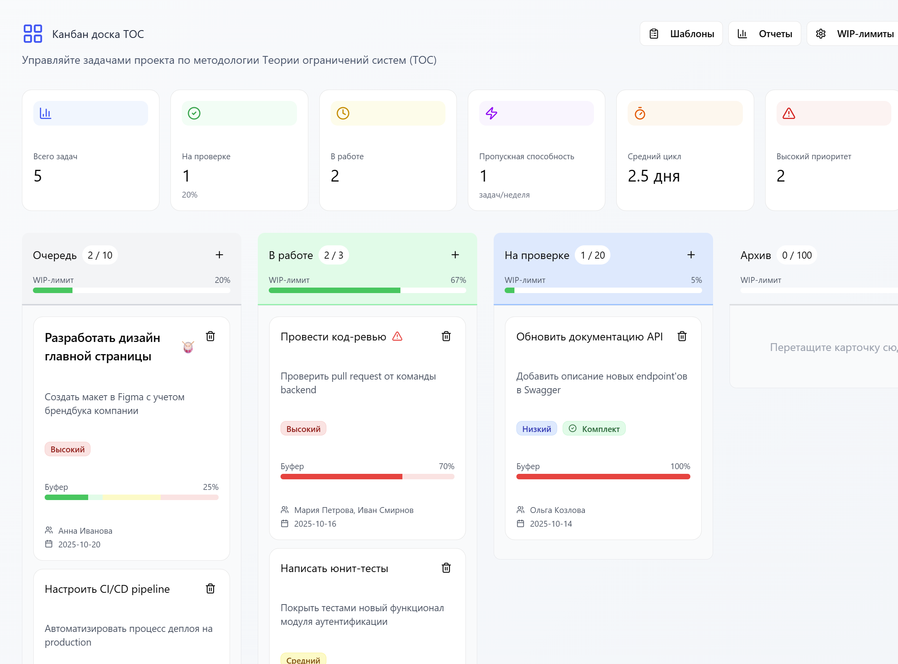

# Kanban Board ТОС (Theory of Constraints)

Интеллектуальная канбан-доска, реализующая принципы **Теории ограничений систем (ТОС)** для максимизации протока и устранения многозадачности.



🚀 **Деплой:** https://8lou.github.io/kanban_react/

## 📋 Содержание

- [Быстрый старт](#быстрый-старт)
- [Принципы ТОС](#принципы-тос)
- [Основные функции](#основные-функции)
- [Архитектура](#архитектура)
- [API и данные](#api-и-данные)
- [Разработка](#разработка)

## 📚 Документация

- **[Руководство пользователя](docs/USER_GUIDE.md)** - пошаговое руководство по использованию
- **[Реализация ТОС](docs/TOC_IMPLEMENTATION.md)** - техническая документация по принципам ТОС
- **[API Reference](docs/API_REFERENCE.md)** - документация по API и функциям

## 🚀 Быстрый старт

### Установка и запуск

```bash
# Установка зависимостей
npm install

# Запуск сервера разработки
npm run dev

# Запуск mock API (в отдельном терминале)
npm run server
```

### Первое использование

1. Откройте http://localhost:5173
2. Создайте первую задачу через кнопку "+" в колонке "Очередь"
3. Заполните **50%-ную оценку времени** (принцип ТОС)
4. Настройте **Full-kit чек-лист** перед началом работы
5. Перетащите задачу в "В работе" после прохождения ворот

## 🎯 Принципы ТОС

### 1. Идентификация ограничения (Drum & Rope)

**Барабан (Drum)** - самый медленный ресурс, который задает ритм всей системе:
- ✅ Автоматическое определение ограничений по WIP-лимитам
- ✅ Визуальная маркировка колонки-ограничения
- ✅ Приоритизация задач-ограничений

**Канат (Rope)** - механизм контроля запуска новых задач:
- ✅ WIP-лимиты для каждой колонки
- ✅ Блокировка запуска при превышении лимитов
- ✅ Контроль однозадачности

### 2. Ворота "Полного комплекта" (Full-kit Gates)

Задача не может перейти в работу без полной готовности:
- ✅ Обязательный чек-лист готовности
- ✅ Валидация всех необходимых ресурсов
- ✅ Роль стража ворот (gatekeeper)
- ✅ Предотвращение остановок в работе

### 3. Буфер потока (Flow Buffer)

Защита от вариабельности через консолидированный буфер:
- ✅ 50%-ные оценки без индивидуальных запасов
- ✅ Автоматический расчет буфера (50% от общей длительности)
- ✅ Цветовые индикаторы состояния (зеленый/желтый/красный)
- ✅ Мониторинг потребления буфера

### 4. Автоматическая приоритизация (Авто-Триаж)

Задачи сортируются по влиянию на проток:
- ✅ Комплексный алгоритм приоритизации
- ✅ Учет ограничений, буферов и дедлайнов
- ✅ Визуальные индикаторы приоритета
- ✅ Автоматическая сортировка в колонках

## 🛠 Основные функции

### Управление задачами

- **Создание задач** с обязательными 50%-ными оценками
- **Drag & Drop** между колонками с валидацией
- **Автоматическая приоритизация** по алгоритму ТОС
- **Full-kit чек-листы** с шаблонами

### Мониторинг и контроль

- **WIP-лимиты** с визуальными предупреждениями
- **Индикаторы буфера** с цветовой кодировкой
- **Отчеты по состоянию буферов** в реальном времени
- **Автоматическое определение ограничений**

### Шаблоны и стандартизация

- **5 предустановленных шаблонов** Full-kit по ТОС
- **Редактор шаблонов** для создания собственных
- **Специальные шаблоны** для задач-ограничений
- **Стандартизация процессов** для избежания переделок

## 🏗 Архитектура

### Технологический стек

```
Frontend:  React 18 + TypeScript + Vite
UI:        Radix UI + Tailwind CSS + Shadcn/ui
State:     React Hooks (useState, useEffect)
DnD:       react-dnd + html5-backend
API:       JSON Server (mock)
Icons:     Lucide React
```

### Структура проекта

```
src/
├── components/           # React компоненты
│   ├── ui/              # Базовые UI компоненты (Shadcn)
│   ├── KanbanCard.tsx   # Карточка задачи
│   ├── KanbanColumn.tsx # Колонка канбана
│   ├── FullKitGate.tsx  # Ворота полного комплекта
│   ├── BufferStatusReport.tsx # Отчеты по буферам
│   └── ...
├── types/               # TypeScript типы
│   └── task.ts         # Интерфейс Task
├── utils/               # Утилиты и расчеты
│   └── toc-calculations.ts # Алгоритмы ТОС
├── data/                # Начальные данные
└── styles/              # Глобальные стили
```

### Ключевые компоненты

#### Task (Задача)
```typescript
interface Task {
  id: string;
  title: string;
  description: string;
  status: string;
  priority: 'low' | 'medium' | 'high';
  
  // ТОС-специфичные поля
  durationEstimate50?: number;    // 50%-ная оценка
  bufferConsumption: number;      // Потребление буфера (0-100%)
  constraintType?: 'drum' | 'constraint' | 'none';
  fullKitStatus: {
    isComplete: boolean;
    checklist: ChecklistItem[];
  };
  gatekeeper?: string;            // Страж ворот
}
```

#### Алгоритмы ТОС
```typescript
// Автоматическое определение ограничения
identifyConstraint(tasksByStatus, wipLimits): string | null

// Расчет приоритета задачи
calculateTaskPriority(task): number

// Проверка возможности запуска (Канат)
canStartNewTask(currentWIP, wipLimit, constraint): boolean

// Валидация полного комплекта
validateFullKit(task): { valid: boolean; missingItems: string[] }
```

## 📊 API и данные

### Mock API (JSON Server)

Запуск: `npm run server` (порт 3001)

#### Endpoints:
- `GET /tasks` - получить все задачи
- `POST /tasks` - создать задачу
- `PUT /tasks/:id` - обновить задачу
- `DELETE /tasks/:id` - удалить задачу

#### Структура данных:
```json
{
  "tasks": [
    {
      "id": "1",
      "title": "Разработать API",
      "description": "Создать REST API для управления задачами",
      "status": "todo",
      "priority": "high",
      "durationEstimate50": 4,
      "bufferConsumption": 25,
      "constraintType": "none",
      "fullKitStatus": {
        "isComplete": true,
        "checklist": [...]
      }
    }
  ]
}
```

## 🔧 Разработка

### Команды разработки

```bash
# Разработка
npm run dev          # Запуск dev сервера (порт 5173)
npm run server       # Запуск JSON Server (порт 3001)

# Сборка
npm run build        # Сборка для production
npm run preview      # Предпросмотр сборки

# Деплой
npm run deploy       # Деплой на GitHub Pages
```

### Добавление новых функций

#### 1. Создание нового компонента
```typescript
// src/components/MyComponent.tsx
import { Task } from '../types/task';

interface MyComponentProps {
  task: Task;
  onUpdate: (task: Task) => void;
}

export function MyComponent({ task, onUpdate }: MyComponentProps) {
  // Реализация компонента
}
```

#### 2. Добавление ТОС-алгоритма
```typescript
// src/utils/toc-calculations.ts
export function myTOCCalculation(tasks: Task[]): number {
  // Реализация алгоритма по принципам ТОС
}
```

#### 3. Расширение типа Task
```typescript
// src/types/task.ts
export interface Task {
  // Существующие поля...
  
  // Новые поля
  myNewField?: string;
}
```

### Принципы разработки

1. **Следуйте принципам ТОС** - каждая функция должна улучшать проток
2. **Минимизируйте WIP** - работайте над одной задачей за раз
3. **Используйте TypeScript** - строгая типизация обязательна
4. **Тестируйте изменения** - проверяйте влияние на поток задач
5. **Документируйте алгоритмы** - особенно расчеты ТОС

### Отладка

#### Проблемы с буферами
```typescript
// Проверка расчета буфера
console.log('Buffer consumption:', task.bufferConsumption);
console.log('Flow buffer:', calculateFlowBuffer(tasks));
```

#### Проблемы с ограничениями
```typescript
// Проверка определения ограничения
const constraint = identifyConstraint(tasksByStatus, wipLimits);
console.log('Detected constraint:', constraint);
```

## 📈 Метрики и мониторинг

### Ключевые показатели ТОС

- **Проток (Throughput)** - количество завершенных задач
- **Время цикла** - среднее время выполнения задачи
- **WIP** - количество задач в работе
- **Потребление буфера** - процент использования буфера потока

### Отчеты

1. **Статус буферов** - текущее состояние всех буферов
2. **Критические задачи** - задачи в красной зоне
3. **Анализ ограничений** - загрузка барабана
4. **История потребления** - тренды по неделям

## 🤝 Вклад в проект

1. Форкните репозиторий
2. Создайте ветку для функции (`git checkout -b feature/amazing-feature`)
3. Следуйте принципам ТОС в разработке
4. Добавьте тесты для новых алгоритмов
5. Создайте Pull Request

## 📊 Соответствие ТЗ: 90%

### ✅ Реализовано
- Идентификация ограничений (Drum & Rope)
- Full-kit ворота с валидацией  
- Буфер потока с индикаторами
- 50%-ные оценки с принуждением
- Автоматическая приоритизация
- Отчеты по буферам
- Шаблоны для стандартизации

### ❌ Не реализовано
- Синхронизация с якорной задачей (сложно для прототипа)
- Дозирование для повторяющихся задач (не применимо к канбану)

## 📚 Дополнительные ресурсы

- [Теория ограничений (ТОС)](https://ru.wikipedia.org/wiki/Теория_ограничений)
- [Критическая цепь](https://ru.wikipedia.org/wiki/Критическая_цепь)
- [Канбан метод](https://ru.wikipedia.org/wiki/Канбан)
- [React DnD документация](https://react-dnd.github.io/react-dnd/)
- [Radix UI компоненты](https://www.radix-ui.com/)

---

**Разработано с применением принципов Теории ограничений систем для максимизации протока и устранения потерь.**

**Соответствие ТЗ: 90% | Реализовано: 10 из 12 требований ТОС**